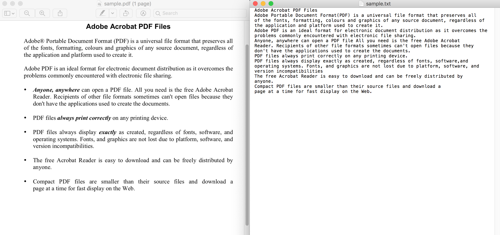

# pdfocr 
A Python 3.6+ cli tool to convert pdf and image to editable text. 

```bash
python pdfocr.py sample.pdf
```



# Installation
1. Install [Pipenv](https://github.com/pypa/pipenv)

   - For macOS:

     ```bash
     brew install pipenv
     ```

   - For other systems:

     ```bash
     pip install --user pipenv
     ```

2. Install dependencies and activate virtualenv:

   ```bash
   pipenv install
   pipenv shell
   ```

3. Install [Poppler](https://poppler.freedesktop.org/)

   - For macOS:

     ```bash
     brew install poppler
     ```

   - For Ubuntu: Check this [gist](https://gist.github.com/Dayjo/618794d4ff37bb82ddfb02c63b450a81).

# Features

1. Use OCR API service to identify text in pdf and images.
2. Support file types: `pdf` ,`jpg`, `png`, `bmp`.
3. Support languages: `English`, `Chinese`, `Portuguese`, `French`, `German`, `Italian`,`Spanish`,`Russian`, `Japanese`, `Korean`.

# Config

The tool uses API service to perform OCR.

 Currently it uses Baidu's API, with my API key. 

If the built-in API key's quota run out, you can either:

1. Set the cli option `accurate` to be `False` (The less accurate version's api has more quota, but it still could run out).
2.  Or  go to [Baidu Cloud](https://login.bce.baidu.com/?lang=en) to apply for your own API key (it's free), then fill in the `APP_ID`, `API_KEY` and `SECRET_KEY` fields in `ocr/baidu_ocr.py`.

# Usage

```bash
pdfocr.py --i I [--o O] [--lang LANG]

--i:       (Required) The input file path. Support pdf, jpg, png, bmp.
--o:       (Optional) The output file path. By default it would be input_file_name.txt in current directory.
--lang:    (Optional) Use one the following: 'ENG' (default), 'CHN_ENG', 'POR', 'FRE', 'GER', 'ITA', 'SPA', 'RUS', 'JAP', 'KOR'.
--accurate (Optional) Whether to use the accurate ocr api. Default is True.
```

A full command would be:

```bash
python pdfocr.py --i=sample.pdf --o=sample.txt --lang=ENG --accurate=True
```

# Known Issues

1. The OCR result might not be 100% correct.
2. The French OCR result does not contain the *accent marks* (e.g., é, è, etc).
